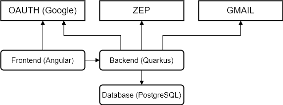

= MEGA

Make End-of-the-month-process Great Again!

This is the repository holding the sources for our *MEGA* application, which provides us an aggregated view over our employees *ZEP* time entries.

*MEGA 1.x.x*

The first intention was to provide our employees an application where at the beginning of a month the employees can check their time entries of the former month.

*MEGA 2.x.x*

In this version we implemented features for project managers whereby the project managers can check project related time entries of their project members.

The following image illustrates the service structure of the MEGA services and external services MEGA depends on.

.Mega Service Structure

The following services are provided by MEGA:

. `Backend` +
The Quarkus microservice representing the REST backend for the frontend application and integrates the external services such as `ZEP` and `GMAIL`
. `Frontend` +
The Apache service hosting the compiled Angular frontend application which retrieves its data from the backend
. link:https://www.postgresql.org/[Database (PostgreSQL)] +
The MEGA database which holds transformed and aggregated data retrieved from the ZEP time management system

The following external services are integrated and used by MEGA:

. link:https://developers.google.com/identity/protocols/oauth2[OAUTH (Google)] +
The OAUTH service provided by Google which is used to authenticate our employees
. link:https://www.google.com/gmail/about/[GMAIL (Google)] +
The Gmail email service provided by Google which is used by MEGA for communicating with our employees
. link:https://www.zep.de/[ZEP] +
The time management system where all our employees enter their time entries

The following listing shows the technologies used by the project MEGA.

- link:https://quarkus.io/[Quarkus 1.6.1.Final]
- link:https://openjdk.java.net/[OpenJDK 11]
- link:https://maven.apache.org/[Maven 3.6.3]
- link:https://nodejs.org/en/[node.js 12.x.x+]
- link:https://www.npmjs.com/[npm 6+]
- link:https://www.postgresql.org/[PostgreSQL 10]
- link:https://www.docker.com/[Docker (Development)]

MEGA depends on an Openshift Infrastructure setup with link:https://github.com/Gepardec/mega-infrastructure[mega-infrastructure:2.x].

== Project setup

The following sections will explain how a developer can setup the local development environment and get MEGA running.

=== Developer PC Setup

You need the following software suitable for your used platform:

. `OpenJDK 11`
. `Maven 3.6.3`
. `NodeJS 12.x.x`
. `Npm 6+`
. `Docker`

=== Backend setup

The backend project is located at `./mega-zep-backend`.

- Start local postgres instance +
`docker run -p 5432:5432 --env POSTGRES_PASSWORD=mega --env POSTGRES_USER=mega --env POSTGRES_DB=mega --name mega-db postgres:10`
- Go to +
`cd ./mega-zep-backend`
- Build the application +
`mvn clean install`
- Start quarkus in development mode +
`mvn quarkus:dev`

The database schema will be created/migrated after the service started with `quarkus:dev`.

=== Frontend Setup

The frontend project is located at `./mega-zep-frontend`.

. Install global dependencies +
`npm install -g @angular/cli`
. Go to the project +
`cd ./mega-zep-frontend/src/main/angular/frontend`
. Install project dependencies +
`npm install`
. Start webserver +
`npx ng serve`
. Test the frontend +
`npx ng test`

The frontend will take some time to come up which is due to the compilation process which takes some time.

=== Secrets

==== Backend
The following file ``./mega-zep-backend/.env`` contains the secret values and has to be added manually by the developers.

./mega-zep-backend/.env
[source,properties]
----
# The auth token provided by ZEP
TOKEN=***
# The gmail password to use
MAILER_PASSWORD=***
## STAGE deployments only, not for local
# The database user
DB_USER=***
# the database users password
DB_PASSWORD=***
# the host:port where to reach the database
DB_HOST=***
----

IMPORTANT: Without this file the backend won't start.

==== Frontend
The following file ``./mega-zep-frontend/src/main/angular/frontend/.env`` contains the secret values and has to be added manually by the developers.

./mega-zep-frontend/src/main/angular/frontend/.env
[source,properties]
----
# The client id of the mega test automation user
MEGA_APP_GOOGLE_CLIENTID=***
# The secret of the mega test automation user
MEGA_APP_GOOGLE_CLIENT_SECRET=***
# The refresh token to poll or refresh the access token
GOOGLE_REFRESH_TOKEN=***
----

IMPORTANT: Without this file it's not possible to run End-To-End tests with cypress.

=== Prepare Test-ZEP for a new team member
* Add the team member's email address to application.yaml (%dev.mega.mail.reminder.om) to grant office management rights
* Open the employee administration and make sure that the team member has the following attributes set:
** email address
** release date

== Database

MEGA uses a database to store persistent data whereby the database is managed by link:https://www.liquibase.org/[liquibase]. +

=== Local development with PostgreSQL

For the local development we use Postgres which is automatically setup by liquibase during `mvn quarkus:dev` startup.
We use the `liquibase-maven-plugin` which provides maven goals to manage the local database.
The source definition of our database schema is the JPA datamodel, and we generate the changeset files via the `liquibase-maven-plugin`.

IMPORTANT: All liquibase maven goals work on the compiled sources and resources located in `./mega-zep-backend/target/classes/`.

=== How to use Liquibase

The following sections provide information about how to use the liquibase-maven-plugin properly.

==== How to generate a full changeset?

. Drop the current database schema +
`mvn liquibase:dropAll`
. Generate the changeset +
`mvn liquibase:generateChangeLog`

IMPORTANT: Ensure that the generated full changeset is proper and that everything has been defined in the JPA model.

==== How to generate a diff changeset?

. Ensure the database is consistent with the current liquibase definitions +
`liquibase:update`
. Generate the diff changeset +
`mvn liquibase:diff`

==== How to apply a changeset?

. Apply newly created changeset +
`liquibase:update`

IMPORTANT: Liquibase updates only work on consistent database states defined by changeset files, and the state persisted in the liquibase specific tables, so if a changeset has already been applied then it cannot be reapplied again anymore, and the database needs to be dropped and recreated in full.

==== How to test a new changeset?

. Try clean install and H2 setup during tests +
`mvn clean install`
. Try application in development and Postgres setup +
`mvn quarkus:dev`

IMPORTANT: Ensure that the database state is on the current released version.

=== Test with H2

For the unit tests we use H2 which is automatically setup by liquibase.
We always get a new H2 instance for each test execution, therefore there will never be incompatibilities, therefore developers don't need to anything.

