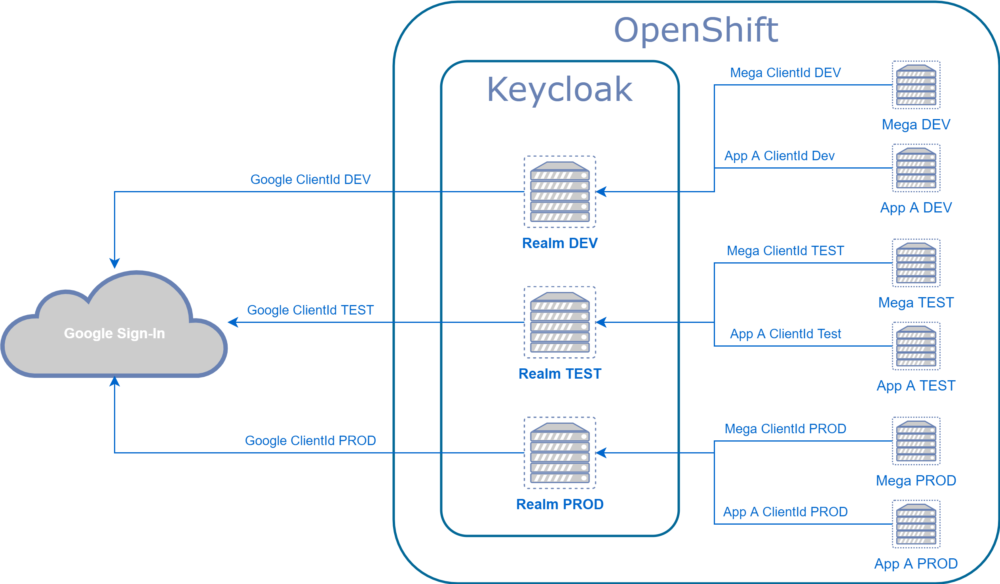

= [draft] Mega V2 Rollenverwaltung

== Keycloak

Für die Rollenverwaltung in Mega (und potentiell allen anderen Gepardec internen Applikationen) soll zukünftig Keycloak zum Einsatz kommen.

Für die Authentifizierung verwendet Keycloak als Identity Provider den Google Sign-In.
Für die Authorisierung werden in Keycloak die entsprechenden Rollen des Users verwaltet.

Je Stage (DEV, TEST, PROD) wird am zentralen Keycloak (zukünftig vllt. mehrere Instanzen?) ein Realm angelegt. Für jeden Realm gibt es einen Google Sign-In Identity Provider mit einer für die Stage spezifische ClientId. In jedem Realm können dann die Applikationen als Clients eingetragen werden (bspw. Mega, App A, ...).

Für Mega werden in den Realms die für Mega notwendigen Rollen angelegt und der Mega ClientId zugeordnet.

== Anpassung Applikation

Nach der Umstellung auf Keycloak müssen in der Applikation die Rollen angepasst werden. Außerdem werden die aktuell vorhandenen Mechanismen zur Prüfung auf die Gültigkeit des Tokens entfernt und alle selbst implementierten Interceptoren durch Java Security Varianten ersetzt. Das noch vorhandene Session Bean kann ebenfalls entfernt werden.

== Stateless

Durch das entfernen des Session Beans sind wir zukünftig in Mega komplett stateless. Aktuell ist noch offen wie wir im konkreten Fall von Mega die ZEP UserId in den Token bekommen. Falls das nicht möglich ist kann die Zuordnung E-Mail-Adresse (im Token vorhanden) zu ZEP UserId über einen Cache abgewickelt werden um stateless zu arbeiten und trotzdem performant zu sein.
